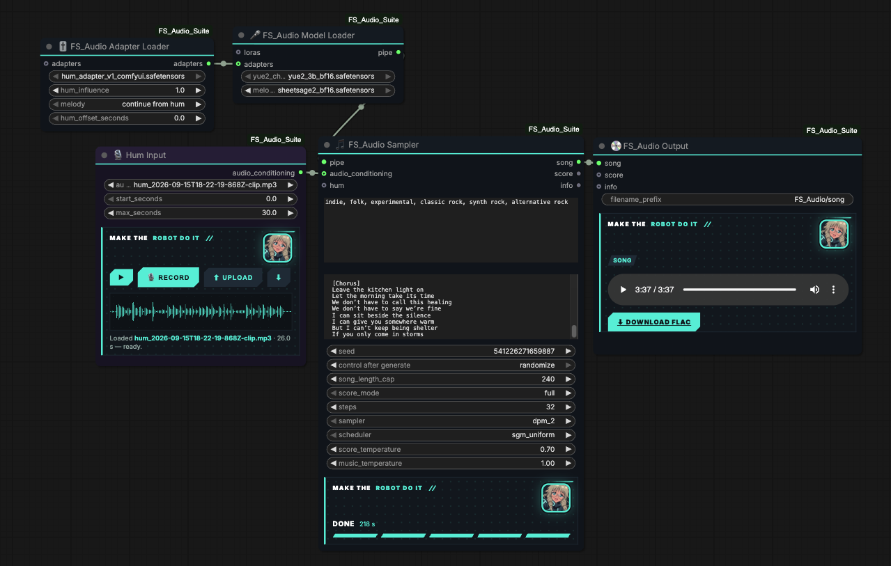

# The Fixed Seed Company Audio Suite

**FS_Audio Suite** — modular YuE2 audio generation for ComfyUI, by Fixed Seed LLC and Make the Robot Do It
**Special thanks to @machinedelusions for the support in making this possible**
Check him out at www.fixedseed.com

 Six nodes, no stock nodes needed. Hum-to-song is the first feature; the suite is built to grow.

| node | role |
|---|---|
| **🎤 FS_Audio Model Loader** | YuE2 checkpoint (`yue2_3b_bf16.safetensors` from Comfy-Org/YuE2) + optional melody transcriber (`sheetsage2_bf16.safetensors` in `models/audio_encoders/`). Left-side inputs take chained **loras** and **adapters** and apply them. Outputs one **pipe**. |
| **🧩 FS_Audio Lora Loader** | Any LoRA in `models/loras/` with model / clip strengths (AR-side LoRAs such as the instrumental LoRA act on CLIP; decoder LoRAs act on MODEL). Chain several by feeding one into the next. |
| **🎚 FS_Audio Adapter Loader** | A conditioning adapter and its behaviour. Today: the hum adapter (`humsong_yue2_adapter_v1_comfy.safetensors`) with **hum influence** (0–3, 1.0 as trained), **melody** mode (continue from hum / hum only / ignore hum) and **hum offset**. Chainable. |
| **🎙 Hum Input** | Record in the node, upload, or pick a file. Play / scrub the waveform, download the take. |
| **🎵 FS_Audio Sampler** | style, lyrics (bare tags: `[intro] [verse] [chorus] [bridge] [outro]`), seed, length cap, **score mode** (full / melody / off), steps, sampler, scheduler (ComfyUI's native lists; defaults `dpm_2` + `sgm_uniform` match the official template). **hum is optional**: without it this is a plain YuE2 generator with the pipe's LoRAs; with a hum and a hum adapter it is hum-to-song. |
| **💿 FS_Audio Output** | FLAC to `output/`, in-node player, download, and the score with the hummed bars highlighted. |

Wiring: Lora Loader(s) → Model Loader `loras`; Adapter Loader(s) → Model Loader `adapters`; Model Loader → Sampler `pipe`; Hum Input → Sampler `hum` (optional); Sampler → Output (`song`, `score`, `info`).

Rules the sampler follows: a connected hum with an adapter whose melody mode is not *ignore* forces a melody-mode score continued from the hum; otherwise **score mode** decides how the planner writes its score. Hum influence 0 keeps the adapter's decoder LoRA but skips the injection. If no adapter is loaded but a hum is connected, the hum still opens the score (continuation) and no injection happens.

Install: clone into `ComfyUI/custom_nodes/ComfyUI-FS_Audio_Suite`, `pip install -r requirements.txt` (librosa, scipy, soundfile). Weights: the hum adapter and other LoRAs from the Make the Robot Do It model cards.

## Training your own LoRA (FS_Audio / Training)

Four additive nodes turn a folder of songs into a planner LoRA that plugs straight back into the **Model Loader**'s `loras` input.

| node | role |
|---|---|
| **⬇ FS_Audio Training Assets** | standalone; downloads the audio → token head and the minted regularizer pack into `models/fs_audio/`. Run once per asset. |
| **📦 FS_Audio Dataset Builder** | folder of songs (`<song>.txt` = style caption, `<song>.lyrics.txt` = lyrics; defaults for missing ones) → real-audio tokens (public MERT-v2-FullSong layer 20 + our head), lyrics normalized to bare tags, optional chord-annotated ABC scores from the pipe's melody transcriber, hash-based hold-out. |
| **🧪 FS_Audio Regularizer** | the minted regularizer pack (`models/fs_audio/*.pt`): YuE2's own songs, coin-flipped against the artist so the LoRA keeps the base model's range. |
| **🏋 FS_Audio LoRA Trainer** | trains the **planner** (what the artist plays) on ComfyUI's own YuE2; outputs a `loras` chain entry (clip strength) plus a JSON report. Saves `<name>_best`, `<name>_step…` into `models/loras/` in ComfyUI's native layout. |
| **🎛 FS_Audio Decoder Adapter Trainer** | trains the **decoder** (how the artist sounds) on the artist's own recordings: rank-32 LoRA on the decoder plus the full vae2llm/llm2vae layers, flow-matching on the dataset's VAE latents conditioned on its tokens. This is the step that made off-genre, real-production audio render faithfully for us. Outputs a MODEL-slot `loras` entry. Defaults: 3000 steps, lr 4e-5 / 2e-5, 30 s windows. |

Trainer switches, all the tricks from our runs: **rank** (64), **steps** (1600), **learning_rate** (4e-5), **artist_fraction** (0.5 coin flip vs regularizer; 0.3 leans harder on the regularizer), **batch_songs** (1; above 1 several coin-flipped songs share one optimizer step, so artist and regularizer songs land in the same update, a mixed batch, at that many times the step time), **score_first_fraction** (0.5: the score sits in front of the music on that share of steps and the planner always learns to write it; needs `transcribe_scores`), **end_token_weight** (1 for artists, ~20 for instrumental / long-song data that runs to the cap), **max_tokens** (whole-song context; songs that would not contain an ending are dropped), **eval_every**, **checkpoint_from / checkpoint_every** (ladder), **seed**. The panel plots training loss (mint), held-out artist loss (white) and regularizer loss (grey) live. Pick checkpoints by ear; past ~1,500 steps on a few dozen songs the planner starts memorizing.

Wiring: Model Loader (with `sheetsage2` if you want scores) → Dataset Builder and both trainers' `pipe`; Dataset Builder → trainers' `dataset`; Regularizer → LoRA Trainer `regularizer`; chain the Decoder Adapter Trainer's `loras` into the LoRA Trainer's output (or the reverse) and feed the chain into a second Model Loader `loras` → Sampler. For an artist far from the base model's genres, train both: the decoder adapter carries their sound, the planner LoRA their writing.

Captions: the builder does not caption for you. Put `<song>.txt` (style) and `<song>.lyrics.txt` next to each song, or rely on the defaults. Style text is flattened to one line with straight quotes; lyrics are reduced to bare section tags (production notes in brackets are dropped, literal `\n` becomes a line break). With `transcribe_scores` on, `auto_tempo_key` appends the transcribed tempo and key to captions that lack them. Memory: 8192 tokens fits a 24 GB card (~15 GB peak); use 12288 on 40 GB+.
